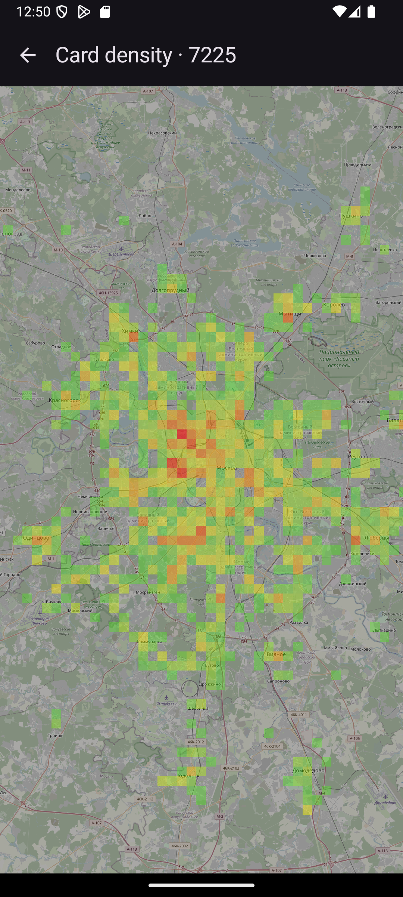
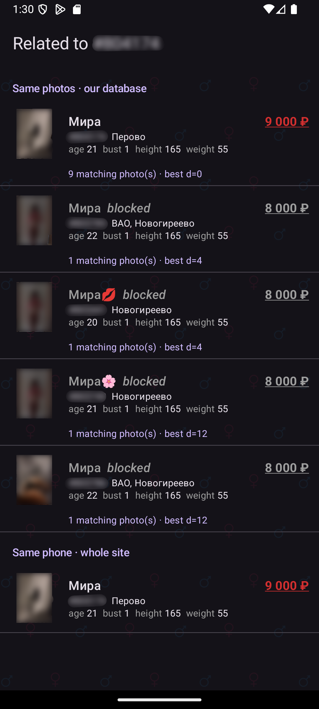
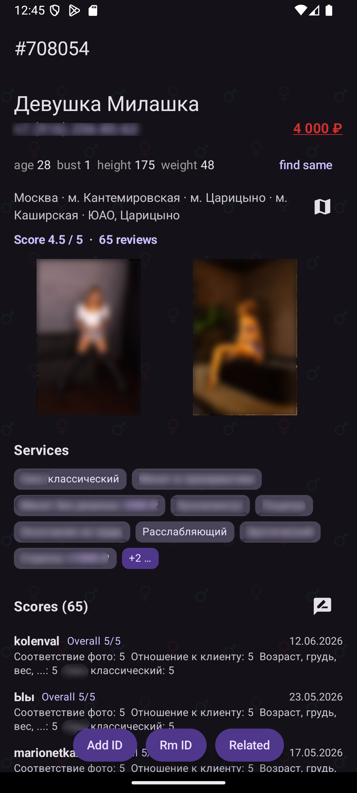
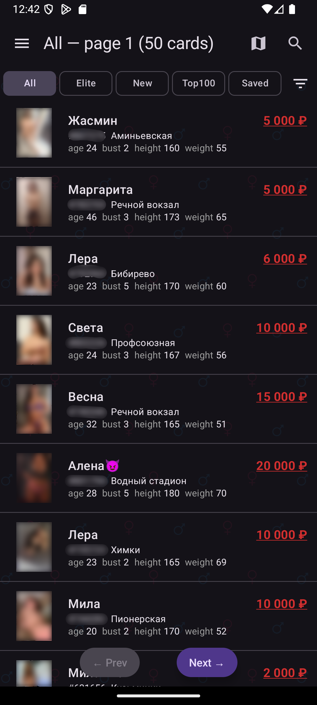
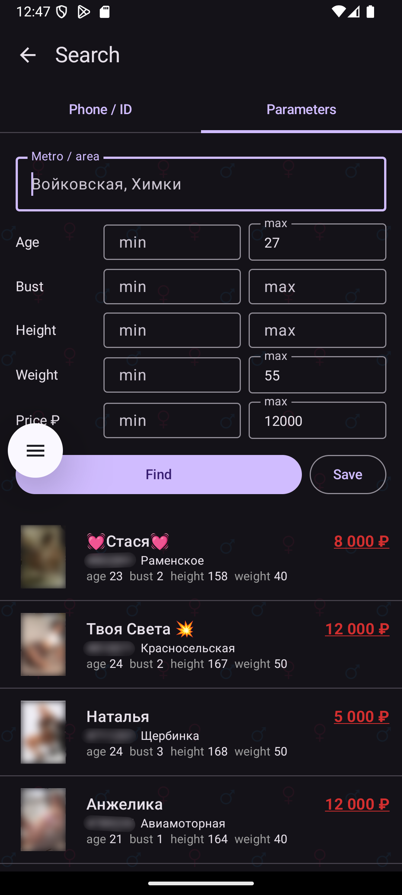
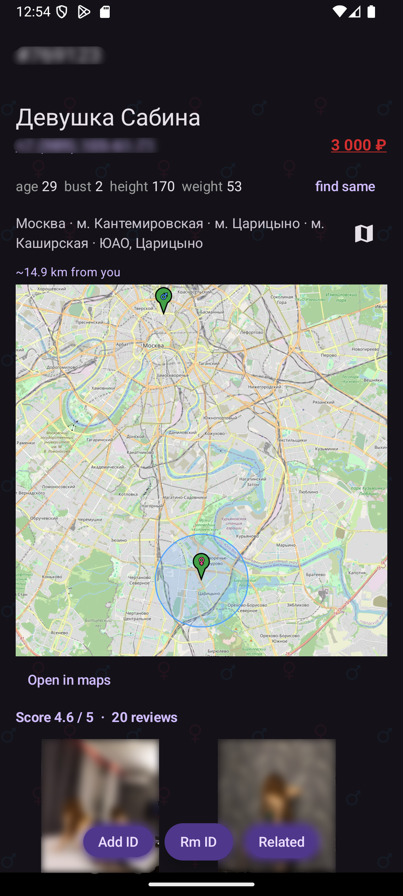
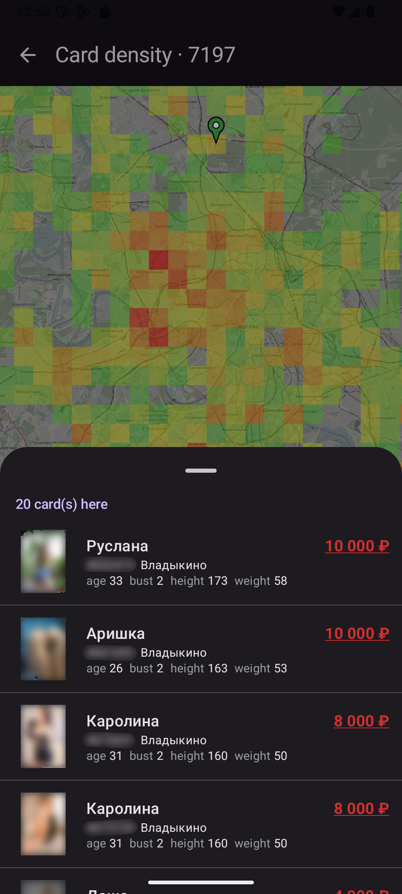

# Men's Companion

Android companion app for the **a.intimstory.ltd** directory — browsing plus a photo‑dedup intelligence layer that tells you which profiles are actually the same person.

## Screenshots

| Card‑density heatmap | "Find same" matches | Profile |
|:---:|:---:|:---:|
|  |  |  |
| **Browse the directory** | **Parametric search** | **Per‑card map** |
|  |  |  |

  
   <em>Tap a heatmap cell to list the cards there.</em>

## How it works

The app is a smarter front‑end for the existing **a.intimstory.ltd** website — it does **not** host or copy the directory.

- **The site is the source of all card content.** Listings and profiles are fetched live from `a.intimstory.ltd` (from your own connection) and parsed **on your device**. The app shows you the same cards the website does, just in a faster, app‑native UI.
- **You use your own site account.** Sign‑in goes **directly to the site**; the same account drives your saved list, reviews and scores. The app only acts on your behalf.
- **A small server adds the intelligence.** The one thing the website can't tell you is *which different cards are really the same person*. A backend service has fingerprinted the directory's photos, computed **face embeddings**, and indexed phone numbers, so the app can answer:
  - **"Find same / Related"** — other cards that share the *same photos* (with how many photos match and how close they are), cards showing the ***same person* even in *different* photos** (face recognition), and cards that share the *same phone* across the whole site.
  - **Search by photo** — pick any photo and find the cards that match it, by face or by the exact same image.
  - **Card‑density heatmap** — where profiles are concentrated across the city; tap a cell to list the cards in it.
  - This server returns **only relationships** (which IDs relate, match counts, coordinates) — never the card photos or text, which always come straight from the site.

In short: **content comes from the site, insight comes from the app.**

## Features

- Browse the directory (All / Elite / New / Top100 / Saved), parsed on‑device.
- **Related / "find same"** — cards that share the *same photos* (image fingerprinting), the *same person* across *different* photos (**face recognition**), or the *same phone*.
- **Search by photo** — pick a photo and find matching cards (by face, or the exact same image).
- Search by phone / ID, by parameters (age, bust, height, weight, price), and by **metro / area** (with optional neighbouring stations).
- Client‑side **filters** (status, price, age, bust, height, weight, location).
- **Card‑density heatmap** of the city — tap a cell to list the cards there.
- Per‑card **map** with the distance from you.
- **Push notifications** — watch a card, or save a search, and get alerted on a face match, a watched profile's changes, or a new card matching your saved search.
- **Video playback** for cards that include videos.
- Saved list, **reviews & scoring**, full‑screen photo viewer with zoom; **long‑press a cover** in any list for a full‑size preview.
- **English / Russian** interface and **light / dark** theme.

## Install

1. Download the latest `mens-companion-<version>.apk` from **[Releases](../../releases)**.
2. Open it on your phone and allow installing from your browser / file manager.
3. Requires **Android 8.0+**. Sign in with your site account for the saved list and reviews.

## 🇷🇺 Описание (на русском)

**Men's Companion** — Android-приложение для каталога **a.intimstory.ltd**. Показывает те же анкеты, что и сайт (данные берутся напрямую с сайта под вашим аккаунтом), но удобнее — и с «умным» поиском дубликатов.

- **«Найти такие же» (Related)** — анкеты с теми же фотографиями (сравнение по «отпечаткам»), **тот же человек на *разных* фото (распознавание лиц)** и тот же номер телефона по всему сайту.
- **Поиск по фото** — загрузите фото и найдите совпадающие анкеты (по лицу или по точному совпадению снимка).
- Поиск по телефону / ID, по параметрам (возраст, грудь, рост, вес, цена) и по **метро / районам** (с соседними станциями).
- **Тепловая карта** плотности анкет по городу — нажмите на ячейку, чтобы увидеть список карточек.
- **Карта** для каждой анкеты с расстоянием до вас (точный адрес, если он указан в анкете).
- **Push-уведомления** — следите за анкетой или сохраните поиск и получайте уведомление о совпадении по лицу, изменениях в анкете или новой подходящей анкете.
- **Видео** в анкетах; долгое нажатие на обложку в списке — просмотр в полном размере.
- Избранное, **отзывы и оценки**, полноэкранный просмотр фотографий; интерфейс на **русском / английском**, **светлая / тёмная** тема.

**Установка:** скачайте `mens-companion-<версия>.apk` из раздела **[Releases](../../releases)**, откройте файл на телефоне и разрешите установку из браузера / файлового менеджера. Нужен **Android 8.0+**. Вход — под вашим аккаунтом на сайте.

*Контент всегда загружается напрямую с сайта; логин и пароль отправляются на сайт, а не на сторонний сервер. В репозитории публикуется только готовое приложение — исходный код закрыт.*

**Похожие запросы:** интимстори, intimstory, intimcity, интимсити, приложение intimstory, intimstory apk, каталог анкет Москва, поиск анкет по фото, поиск по лицу, распознавание лиц, дубликаты анкет, проверка анкет, один человек разные анкеты, досуг Москва.

---
*This repository hosts the app release only — the source code is not published.*
